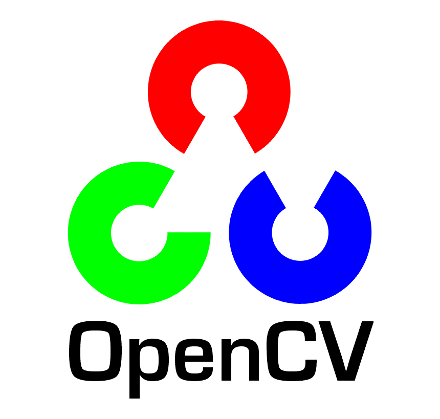

<h1 align="center"> Hi, I'm <a>Trung Tran Minh</a></h1>
  

  

### ***About Me***
My orientation is following the direction of application engineering with topic: Deep Learning for Computer Vision, Prompt Engineer, Data Analysis, and Data Engineer.
  
Here is my [Portfolio](https://j3rrytran.github.io/myporfolio/), you can download my resume in my portfolio.

 

### ***Education and Certification***
🎓 Bachelor of Data Science at University Technology and Science in Hanoi (USTH) 2020-2024

#### ***Field***
Data Analysis, Data Visualization, Image Processing, Computer Vision, Natural Language Processing.
 

### ***🧑‍💻 Programming Language***

 

### ***🛠 Platforms***

 

### ***🪟 Frameworks***

    
    Pytorch

    
    Hugging Face

    
    Natural Language Toolkit

    
    OpenCV

    
    Ultralytics

    
    Numpy

    
    Matplotlib

    
    Pandas

    
    Point Cloud

    
    Spring Boot

    
    SQLite

    
    MySQL

    
    PostgreSQL

    
    OracleDB

 

<i>Connect to me!</i>
 

    <code></code>
    <code></code>
  
   

